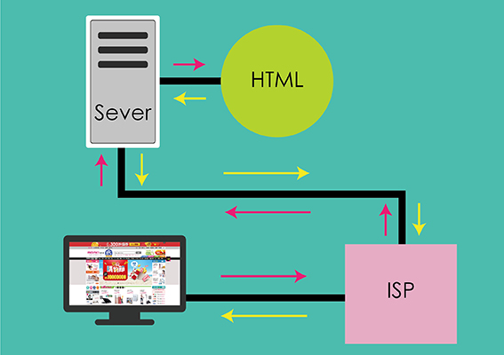

# 網頁設計初學習

網頁是由 HTML 和 CSS 組成，HTML 是網頁的基本骨架，也是最寫網頁最基本的標記語言。

## 網頁**是**如何操作?

* 網頁是由W3C自訂出來一套標準專屬網頁的文件\(doctype\)
* 電腦透過互聯網供應商ISP \(Internet Service Provider\)連上網路
* 內容顯示和讀取文件，是必須用電腦了解的語言和規則組成，也就是HTML標記語言 
* HTML語言將網頁轉換成我們可以在電腦螢幕上看到的頁面

## HTML 是甚麼?

* HTML \(Hyper Text Markup Language\) 是構成網頁的基礎
* HTML是由W3C\(World Wide Web Consortium:全球資訊網組織\)所制定出來的標準語言
* 網頁構成必須符合W3C規範才能正常解譯，瀏覽器都是以符合 W3C標準開發出
* HTML 使用「標記」（markup）來詮釋文字、圖像、或是其他能在瀏覽器裡面顯示的內容

