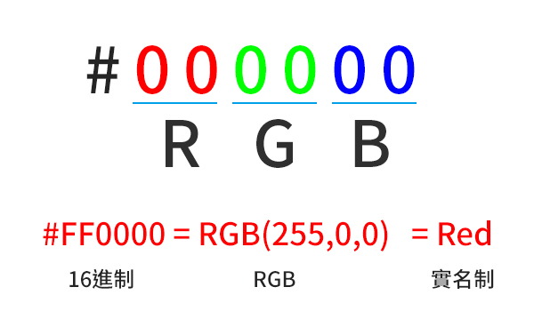
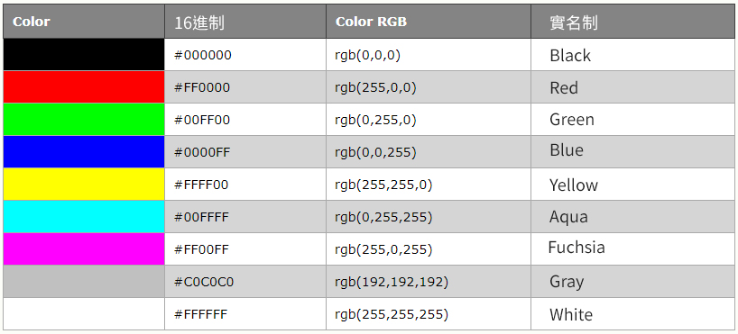

# Color顏色

網頁的顏色是使用十六進制數字表示，以「\#」號開頭，後面分別為**R、G、B**的16位元進制數。

每位元組從**00**到**FF**，相當十進位數字從**0**到**255**，最小值為0`(十六進制:#00)`，最大數值為255`(十六進制:#FF)。`

顏色除了用十六進位表示外，也還有使用 RGB 的表示方式，或 實名

#### 216 跨平台色

網頁的安全色，也就是瀏覽器在大部分的電腦能顯示的色彩共 **256** 色。

一系列 216 種 Web 安全色作為 Web 標準被建議使用。其中的原因是，微軟和 Mac 操作系統使用了 40 種不同的保留的固定係統顏色（雙方大約各使用 20 種）。

216 跨平台 web 安全色被用來確保：當電腦使用 256 色調色板時，所有的電腦能夠正確地顯示所有的顏色。

