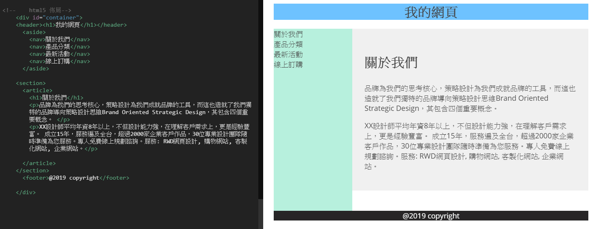

# HTML5的網頁語意標籤佈局

### 用語義標籤製作HTML5文件的好處：

* 看標籤就可以知道哪一個部份是標題、哪裡是選單。
* 對搜尋引擎、使用者來說方便判讀。
* 搜尋引擎在搜尋網頁內容時，可以搜尋到準確的資料與資訊。
* 標籤都具有意義，在維護網頁文件時，就會變得更簡單與容易，在團隊的工作中尤其重要。

### 語義化標籤

### HTML 4的佈局

### HTML 5的佈局

