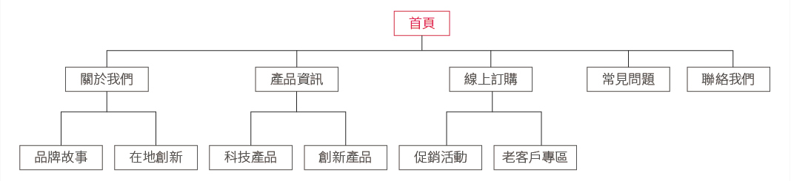
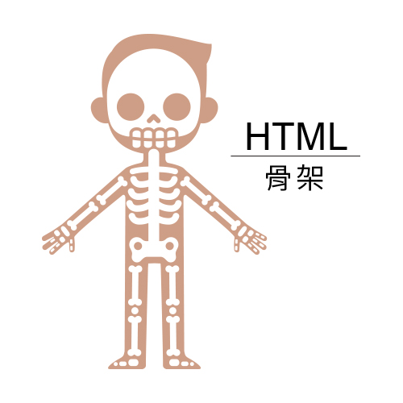

# 準備建立網頁

## 首先，你要規劃網頁

網頁由HTML+CSS組成，所以在這之前須先做好網站規劃

* 你的網站主題是甚麼?
* 你的網站外觀初步是甚麼樣子?
* 你的網站架構內容有哪些?

你可以用手繪的草圖 \(Sketching\)先規劃出網站的外觀雛型，不需要畫得很漂亮，只需要讓人清楚看出來網頁整體的想法。

設定網頁風格

* 你的網頁主題風格配色[\(線上配色\)](xian-shang-pei-se.md)
* 網頁文章內容
* 網頁會用到的圖片也要準備好

規畫層次化的網站架構圖，樹狀圖 \(tree map\)，也就是網站架構內容

每一個主類別都是單一且特別的，樹狀結構也是整個網站的精隨和骨架，也會是將來網站導航和URL的結構，更會是網頁完成後 SEO 的重要依據。

完成前面的草圖與網頁架構規劃，才會開始進行網頁視覺版型設計

可以用繪圖軟體，先設計好網頁版型的視覺平面圖，再來做HTML切版

完成後就要開始撰寫HTML

HTML 就是網站的骨架，要將網站撐起來，CSS則是網站的皮膚和衣服，有CSS你的網頁視覺才會呈現出圖像和色彩

