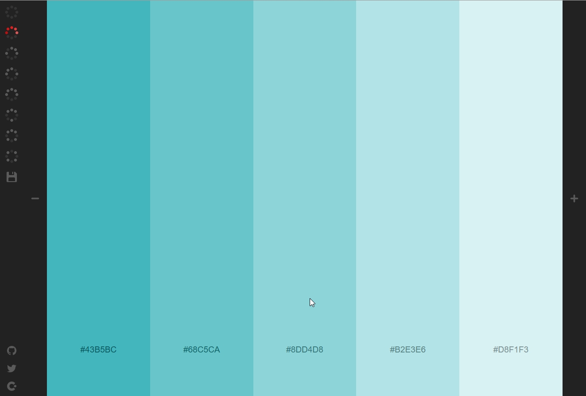

# 線上配色

### [Colourcode](https://colourco.de/)

隨意產生色卡，也可以刪除或是調整色值，並儲存

### [Awwwards](https://www.awwwards.com/)

這是一個蒐集非常多優秀網站的地方，非常多的設計案例，可以拿來參考看看別人都怎麼配色，多欣賞別人的作品，培養自己的網頁配色敏感度

Awwwards也是前端設計界最有影響力的獎項之一，每天評選在設計和技術表現上突出的網頁作品

以五項作為評分標準，設計感、易用性，創新性，內容、行動版。來做平均總分

###  [LOL Colors](https://www.webdesignrankings.com/resources/lolcolors/)

很可愛的色彩配色網站，都直接幫你配好，你只要隨便選一個來用就好了

###   [NIPPON COLORS](http://nipponcolors.com/)

傳統的色彩搭配，充滿亞洲東方色彩韻味的配色網站，裡面都是傳統色

### [coolors](https://coolors.co/)

### [uigradients](https://uigradients.com/#Ali)

