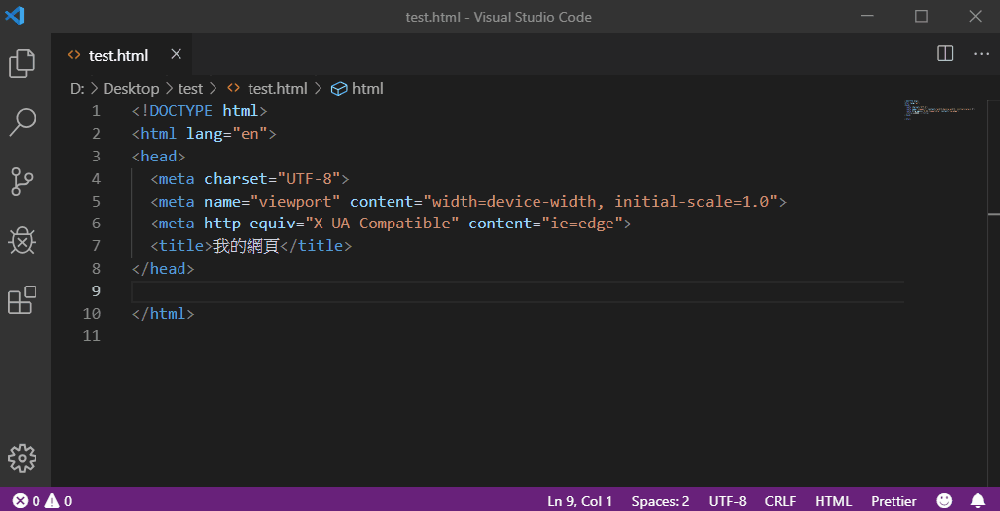
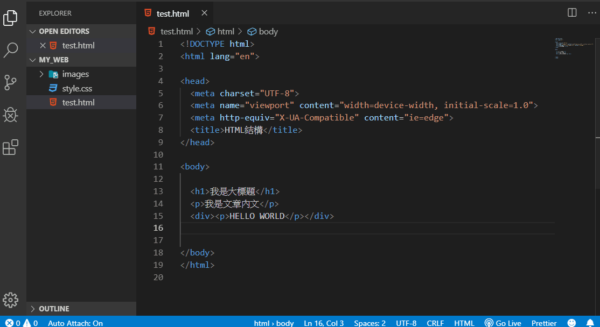
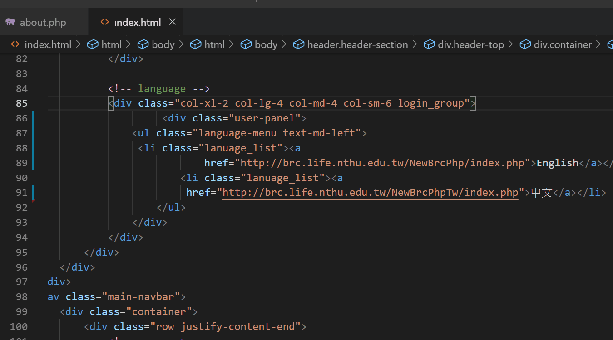
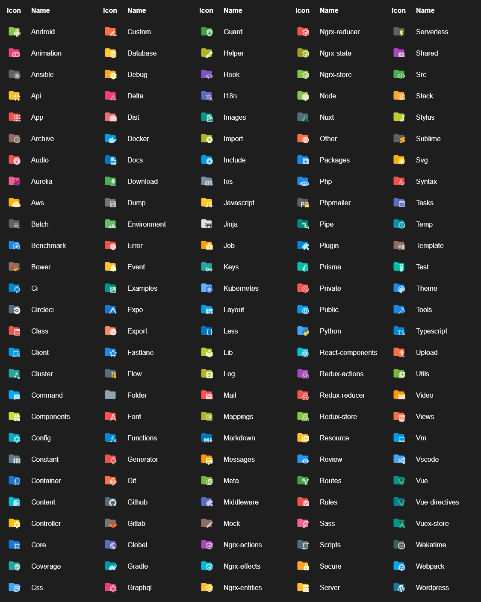
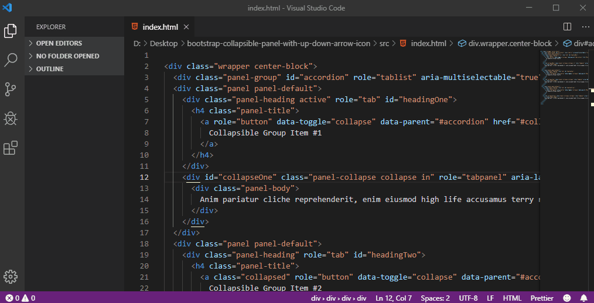
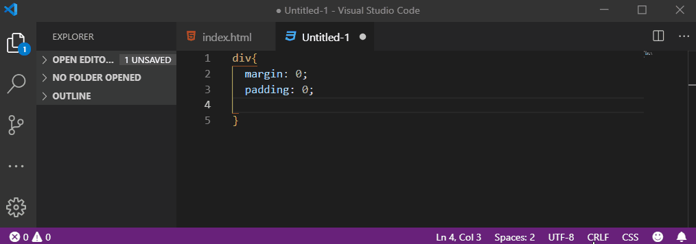
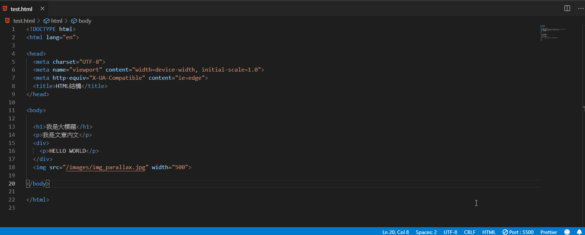

# vs code 套件

### [Bracket Pair Colorize](https://marketplace.visualstudio.com/items?itemName=CoenraadS.bracket-pair-colorizer)

刮號前後一組，使用同樣的顏色來分辨有沒有完整，讓使用者很容易看清楚。

### [Auto Close Tag](https://marketplace.visualstudio.com/items?itemName=formulahendry.auto-close-tag)

自動在開始標記的結束括號中輸入時就自動添加結束標記，非常方便，避免少打一個標記而造成網頁跑版。

### [Auto Rename Tag](https://marketplace.visualstudio.com/items?itemName=formulahendry.auto-rename-tag)

讓成對的標籤同時自動一起修改，不用一個一個修改

### [AutoFileName](https://marketplace.visualstudio.com/items?itemName=JerryHong.autofilename)

讓編輯器自動連結圖片或是檔案路徑，不需要自己找。

### [Beautify](https://marketplace.visualstudio.com/items?itemName=HookyQR.beautify)

美化網頁原始碼讓網頁原始碼可以自動縮排，排列整齊、支援 javascript、CSS 和 HTML 。

安裝好後，將要排列整齊的區塊圈選起來，點鍵盤「F1」就可以區段美化。

### [Material Icon Theme](https://marketplace.visualstudio.com/items?itemName=PKief.material-icon-theme)

圖示標示，安裝後也比較清楚各種語法類型

### [Highlight Matching Tag](https://marketplace.visualstudio.com/items?itemName=vincaslt.highlight-matching-tag#review-details)

選擇起始標記就會自動也選提示結束標記，讓使用者輕鬆辨識成對的語法。

### [Css auto prefix](https://marketplace.visualstudio.com/items?itemName=sporiley.css-auto-prefix)

自動產生支援IE、Safari 和 Chrome 的替代属性前輟詞，以符合各個瀏覽器。

### [Preview on Web Server](https://marketplace.visualstudio.com/items?itemName=yuichinukiyama.vscode-preview-server)

**按鍵盤 F1**：在編輯器中開起視窗

* **Resume the web server  `Ctrl+Shift+R`**：先開啟Server伺服器，才能預覽
* **Preview on side panel   `Ctrl+Shift+V`**：在編輯器中開啟右側預覽
* **Launch on browser   `Ctrl+Shift+L`**：在瀏覽器中開啟網頁預覽
* **Stop the web Server**   **`Ctrl+shift+S`**  ：關閉Server伺服器

### [Bootstrap 4 & Font awesome snippets](https://marketplace.visualstudio.com/items?itemName=thekalinga.bootstrap4-vscode)

